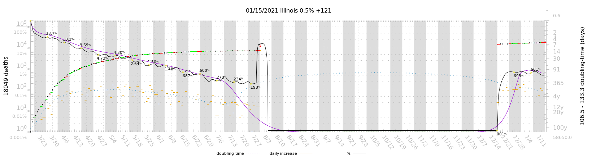
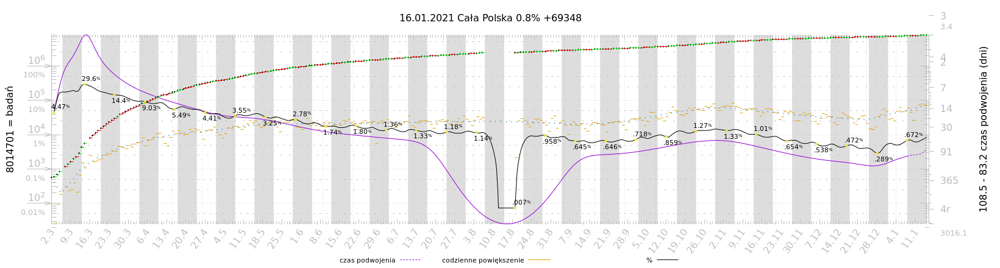
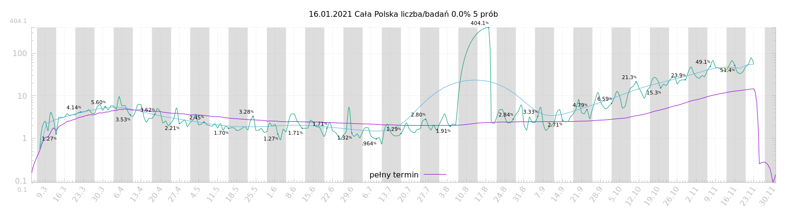

# COVID19IL

[daily plots](https://msliczniak.github.io/COVID19IL/plots/index.html)

[codzienne wykresy](https://msliczniak.github.io/COVID19IL/plots/pl/index.html)

[Kane co, IL](https://msliczniak.github.io/COVID19IL/plots/kane/index.html)

[US States and Territories](https://msliczniak.github.io/COVID19IL/plots/us/index.html)

[selcted countries](https://msliczniak.github.io/COVID19IL/plots/csse/index.html)

unique point filter of
seven sample non-linear least-squares regression fit to exponentional with cubic
spline damping doubling-time

[NOTES](NOTES.txt)

req gnuplot(pngcairo)

edit paths in scripts if needed
