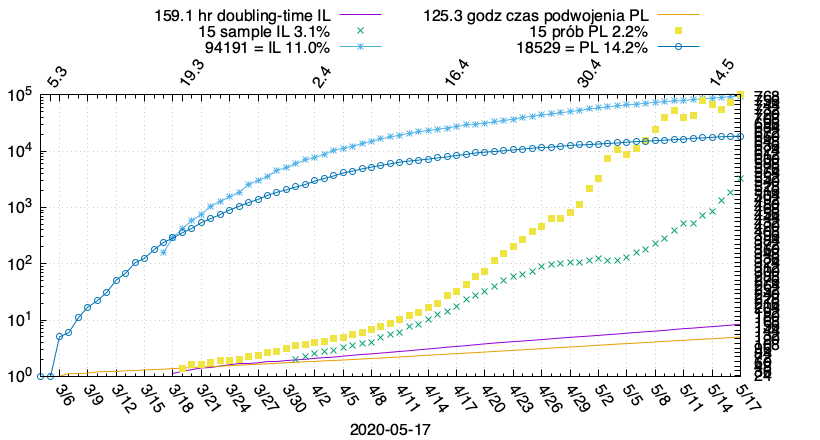

# COVID19IL

[daily plots](https://msliczniak.github.io/COVID19IL/plots/index.html)

[codzienne wykresy](https://msliczniak.github.io/COVID19IL/plots/pl/index.html)

[NOTES](NOTES.txt)

req gnuplot(pngcairo)

edit paths in scripts if needed
